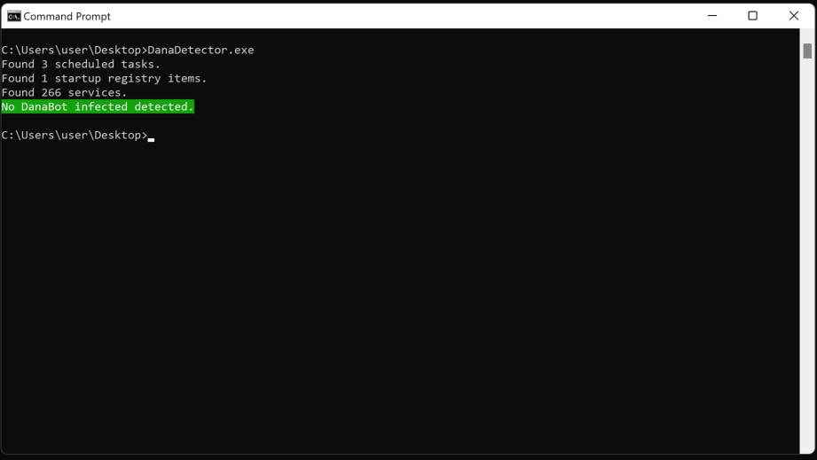
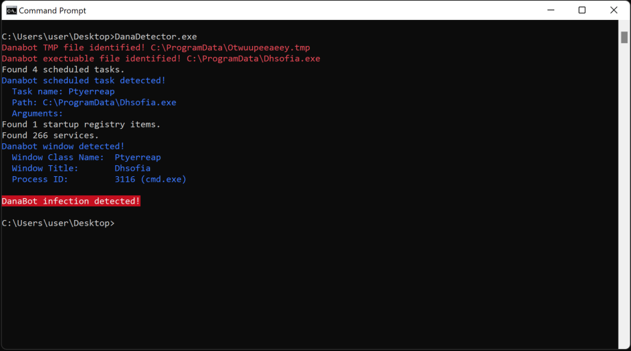

# DanaDetector 

A tool to detect DanaBot infections.

# Compatibility
DanaDetector is compatible with Windows 7 through Windows 11 and supports recent versions of DanaBot.

# Usage
```
Usage: DanaDetector.exe v0.1 [options]
        -d    --debug                Debug mode.
        -h    --help                 Show help and exit.
```
# Clean System Demo


# Active Infection Demo


# Reference Blog
More details about DanaDetector and DanaBot can be found here: https://www.zscaler.com/blogs/security-research/operation-endgame-2-0-danabusted

# Example DanaBot Samples
|SHA256|Description|
|-----------------------------------------------------------------|-------------------|
|2f8e0fc38eaf08a69653f40867dcd4cc951a10cd92b8168898b9aa45ba18a5c8 |DanaBot main module|
|871862d1117fd7d2df907406a3ce08555196800b0ef9901dd4c46f82b728263d |DanaBot main module|

